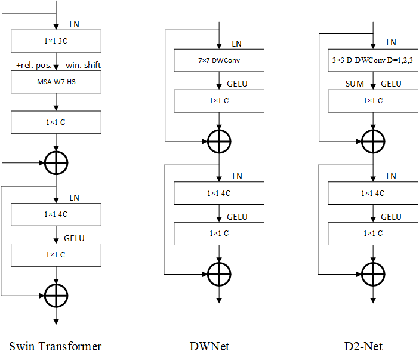

# D2Net: Depthwise And Dilated Convolution Network

------

## ImageNet

|                 model                  |   Date    | image size | #param | top-1 acc |
| :------------------------------------: | :-------: | :--------: | :----: | :-------: |
| mobilevit_xxs(w/ multi-scale sampler ) | ICLR 2022 |    256     |  1.3M  |   69.0    |
| edgenext_xxs(w/ multi-scale sampler )  | ECCV 2022 |    256     |  1.3M  |   71.2    |
|            mobilenetv2-0.35            |   2018    |    224     |  1.7M  |   60.3    |
|            mobilenetv2-0.5             |           |    224     |  2.0M  |   65.4    |
|            mobilenext-0.35             | CVPR 2020 |    224     |  1.8M  |   64.7    |
|             mobilenext-0.5             |           |    224     |  2.1M  |   67.7    |
|                 D2Net_xxs                 |           |    256     | 1.55M  |   70.7    |

## RS

|       model       |    Dataset     |     Acc     |
| :---------------: | :------------: | :---------: |
|    mobilenetv2    | AID0.5/NWPU0.2 | 95.12/91.19 |
| mobilenetv3_small | AID0.5/NWPU0.2 | 94.60/90.80 |
|     D2Net_xxs     | AID0.5/NWPU0.2 | 95.15/90.85 |

<!--AID 0.5 train:test 0.5:0.5 -->

<!--NWPU0.2 train:test 0.2:0.8 -->

## References

Our code is based on [EdgeNeXt](https://github.com/mmaaz60/EdgeNeXt) and [ConvNeXt](https://github.com/facebookresearch/ConvNeXt) repository. We thank them for releasing their code.
